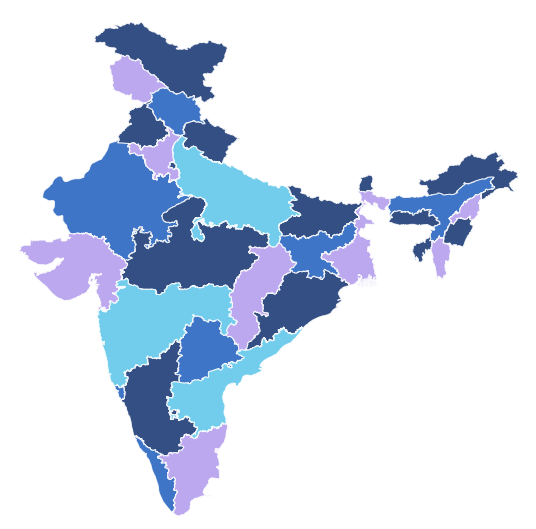

# Map-coloring

Map coloring refers to the coloring of various regions of a map such that adjacent regions(which share a boundary) don't have the same color.We would also like to use as few colors as possible.  
In this project, the greedy algorithm is first used to color the maps of India and USA.Greedy approach makes use of 5 colors but according to the four color
map theorem, no more than four colors are required to color the regions of any map. To get the 4 colored map, backtracking algorithm is applied.  

Shapefiles of *India* and *USA* are taken, the respective algorithms are applied and the colored maps are obtained.

